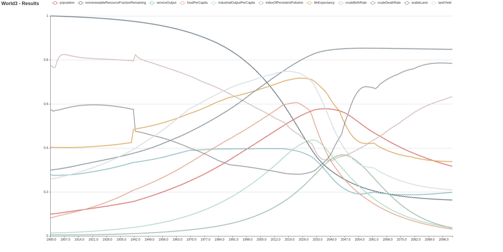

# World3

This is a fork of [eighties-cities/world3](https://github.com/eighties-cities/world3) which implements the world3 model from *[The limits to growth](https://en.wikipedia.org/wiki/The_Limits_to_Growth)* in scala language.

## Layout

* **display** : Main program to show simulation results
* **html** : html page to be rendered by github pages
* **model** : the actual model

## Results

Lastest result can be visualized by reaching [viewer page](https://raymas.github.io/world3/viewer/).

## Display
> sbt
> sbt> runDisplay

Then browse the display.html file
